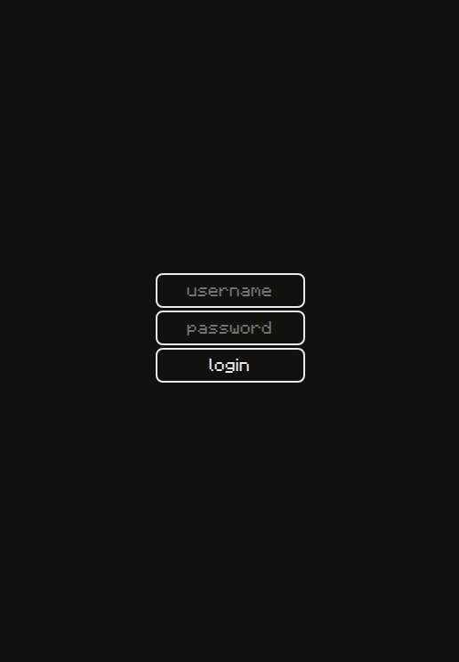

# :leaves: spring-security-with-jwt

## What are we going to build?

A demonstration on how to use [JWT](https://jwt.io) authentication with [Spring Security](https://spring.io/projects/spring-security).

## TODO list

- [ ] JWT authentication with Spring Security and [jjwt](https://github.com/jwtk/jjwt)
  - [ ] Implement integration tests for authentication
- [ ] Implement a few business logic with user roles and permissions
  - [ ] Implement integration tests for roles and permission
- [x] Integrate with SQL databases for fetching user credentials
  - [x] Creating user repositories with [spring-data-jdbc](https://spring.io/projects/spring-data-jdbc)
  - [x] Use [flyway](https://flywaydb.org) to manage database migrations
- [x] Integrate with [github actions](https://github.com/features/actions) to run integration tests
- [ ] Implement simple front-end with [React](https://reactjs.org) that integrates with back-end to 
demonstrate authentication and the business logic
  
